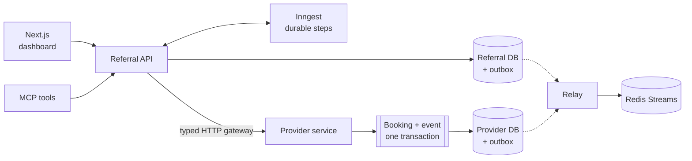
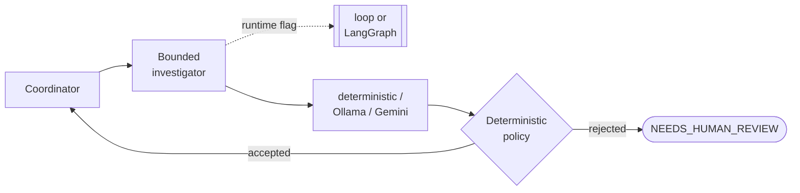
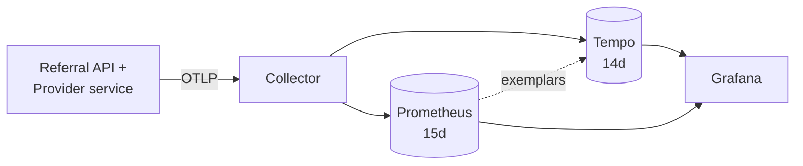
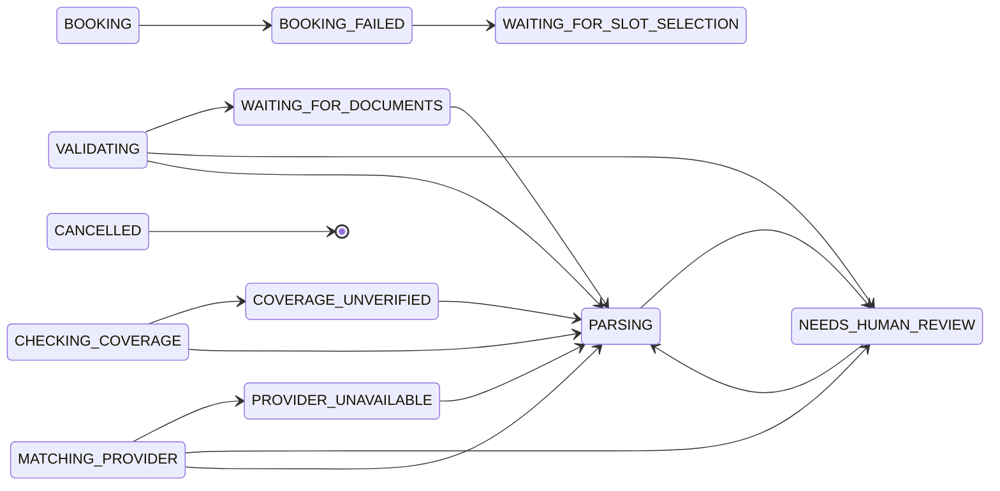
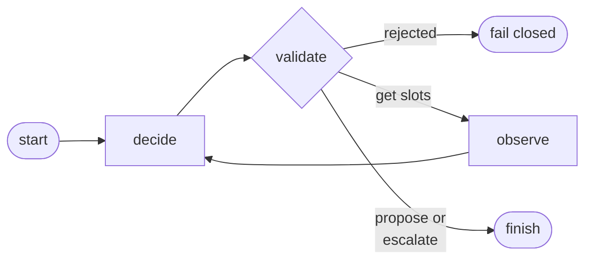
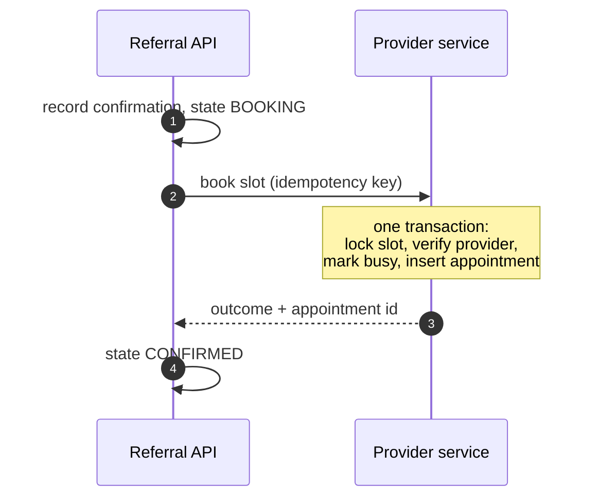

# CareRoute

A referral-coordination system that demonstrates how to put a language model inside an administrative workflow **without letting it become the authority**. Deterministic code owns every decision that has a consequence; the model is confined to interpreting ambiguity and making proposals that must survive validation before anything happens.

## Scope and safety notice

**This project runs entirely on synthetic data and is not a medical device.**

- It does **not** diagnose, prescribe, triage by acuity, or recommend treatment.
- It makes **no claim of HIPAA compliance** and must not be used with real patient data.
- All patients, providers, coverage records, documents, and schedules are generated fixtures.
- Its decisions are administrative only: which specialty a referral was submitted under, whether required paperwork is present, which providers are eligible, and which appointment slots are free.

It is a portfolio and research system for distributed-systems and agent-safety design, not a clinical product.

## The safety boundary

This is the central idea of the project, and everything else is built to enforce it.

Deterministic code owns workflow state, authorization, eligibility, validation, retries, idempotency, and every side effect. A model is invoked only at a bounded ambiguity boundary, and only to *investigate and propose*.

Three investigator loops exist — specialty interpretation, missing-document inference, and provider ranking. Each is hard-capped in turns and evidence calls. Every proposal is schema-constrained and must be **grounded in a candidate set the deterministic layer already produced and observed**. A proposal that is invalid, premature, references anything outside that observed set, or arrives before its evidence does, fails closed.

Concretely, a model in this system **cannot**:

- write workflow state,
- select an appointment slot,
- book, confirm, or cancel anything,
- reach a provider or slot it was not already shown,
- widen its own turn or evidence budget.

A valid provider proposal changes only the **presentation order** of candidates. It does not record a patient's choice. Booking requires an explicit, separately confirmed human command.

This is auditable rather than asserted. Every model turn emits an `agent.turn` span immediately followed by an `agent.policy.validate` span, so the trace itself shows that deterministic validation ran between the model speaking and anything occurring.

### The boundary, adversarially evaluated

Claiming a boundary holds is easy. `careroute-agent-eval` drives a model that misbehaves *deliberately* against all three investigator loops and reports which guardrail caught it.

Fourteen scenarios, thirteen of them violations, each wrong in exactly one respect: a specialty that contradicts the referral, a specialty proposed before any evidence was gathered, a malformed response, a document not grounded in an observed procedure, a provider proposed before its availability was looked at, a provider outside the candidate set entirely, a proposal that skipped a matching candidate, one with no free slots, one that is not the earliest available.

Two design choices are what make it an evaluation rather than a louder test run.

**Each case names the rule it should trip.** Rejection alone is not a pass — rejection by the rule being probed is. A violation stopped by an unrelated rule is a boundary that is right by accident, and the report counts those separately. This distinction is not hypothetical: swapping one rule's message leaves every run still failing closed in `NEEDS_HUMAN_REVIEW`, and a coarser harness would score it green.

**Honest models are scenarios too.** A boundary that refused everything would score perfectly against violations alone, so a correctly-ranking model and two that legally decline — escalate, request clarification — run alongside, and their acceptance is checked just as strictly. The declining cases must degrade to unranked human slot selection rather than fail.

The provider cases run under **both investigation runtimes**. The policy is shared code; running both is the evidence.

```
policy violations attempted     13
refused by the intended rule    13
refused by a different rule      0
reached referral state           0
legal decisions honoured         8 of 8
escalations degraded to human    4

specialty: 4/4   document: 2/2   provider: 16/16
both runtimes reached the same verdict on all 8 provider cases
```

The harness exits non-zero on any deviation and runs in CI. Its own ability to fail is tested: deleting a policy rule must make it report a wrong state, and swapping a rule's message must make it report a wrong rule.

The models are scripted rather than sampled from a real one, deliberately. A real model cannot be relied on to produce the same violation twice, and a case that does not reproduce cannot be asserted on. How *often* a given model violates policy is a different question, and one this does not answer — that answer would be about the model, not about the boundary.

## Architecture

**Services and data.** Two domains, two databases, no shared storage.



**Agent path.** A model may propose; only deterministic policy may accept.



**Observability.** Applications know only the Collector.



Every arrow into the provider domain is an HTTP request, never a query. The dotted line from the investigators to `AGENT_RUNTIME` is the orchestration flag; both runtimes route through the same deterministic policy box, which is the only thing that can approve a model's proposal.

**The two services own separate databases.** The provider domain owns providers, schedules, slots, appointments, and booking records; the referral domain owns everything else. Neither reads the other's tables. References that cross the boundary are validated UUIDs with no foreign key, because a foreign key cannot be enforced across databases.

The referral API reaches the provider service only through a typed asynchronous gateway that separates transient failures (timeouts, connection errors, 429, selected 5xx) from permanent protocol failures, and fails closed on malformed payloads and correlation mismatches. Retries use exponential backoff with full jitter.

A **circuit breaker** sits around the whole call. Retries stop one caller hammering a struggling dependency; they do not stop every caller doing it at once, and while a dependency is down each request still pays its full retry budget before failing. After five consecutive transient failures the breaker opens and fails immediately, then lets a single request through after thirty seconds to test recovery. Measured against a stopped provider service, calls dropped from ~0.2 s to ~0.004 s once open, and the circuit closed on its own once the service returned.

Only transient failures move it. A 4xx or a malformed payload means *this* system sent something wrong, so tripping on those would turn a local bug into an apparent outage and take the dependency out of service for every other caller.

**Booking executes inside the provider service**, where the slot and the appointment live, so the lock, the slot state change, and the appointment write remain a single transaction. It is requested with a caller-supplied idempotency key, and the provider side records its decision — refusals as well as successes — so a caller that loses the response can repeat the request and learn the original outcome rather than act twice.

**Domain events go through a transactional outbox.** Each database has its own outbox table, written in the *same transaction* as the state change it describes — a commit followed by a separate publish is not atomic, and would either announce something that rolled back or silently lose something that happened. A relay claims rows with `SELECT ... FOR UPDATE SKIP LOCKED`, publishes to Redis Streams, then marks them dispatched. It publishes *before* marking on purpose: a crash between the two produces a duplicate, which consumers absorb, rather than a silence, which nothing downstream can repair.

The relay runs outside the request path, so a broker outage delays delivery instead of failing a user-facing operation. Redis uses AOF with `appendfsync everysec`; the resulting one-second window of acknowledged-but-unwritten events is survivable because the outbox holds the authoritative record.

The referral API owns referral coordination, the workflow state machine, confirmation gating, model adapters, patient and coverage tools, MCP, and FHIR translation.

### Workflow states

Every transition below is enforced by an explicit allow-list in `workflow.py`. A move that is not drawn here raises `InvalidTransition` and is rejected — including any a model might propose. Ambiguity routes to `NEEDS_HUMAN_REVIEW` rather than to a guess.

```mermaid
stateDiagram-v2
    direction LR
    [*] --> RECEIVED
    RECEIVED --> PARSING
    PARSING --> VALIDATING
    VALIDATING --> CHECKING_COVERAGE
    CHECKING_COVERAGE --> MATCHING_PROVIDER
    MATCHING_PROVIDER --> WAITING_FOR_SLOT_SELECTION
    WAITING_FOR_SLOT_SELECTION --> BOOKING
    BOOKING --> CONFIRMED
    CONFIRMED --> [*]
```



Every way of pausing or failing returns to `PARSING` rather than skipping ahead, so a resumed referral is re-evaluated from the start instead of continuing on stale conclusions:



`BOOKING` is the sole route into `CONFIRMED`, and it is gated on a recorded confirmation command. Cancellation is reachable from every non-terminal state and is omitted from both drawings, because thirteen identical edges would bury the shape of everything else.

This diagram is verified by `tests/test_readme_diagram.py`, which parses it and compares it against the transition table in the code. If they ever disagree, the test fails rather than the README quietly misleading a reader.

### The provider investigation, as a graph

The provider-ranking investigator ships in two interchangeable orchestrations, selected by `AGENT_RUNTIME`: `legacy`, a handwritten loop, and `langgraph`, a bounded state graph. They share one deterministic policy — the graph imports the loop's available-action and validation functions rather than restating them, so the two cannot drift apart.



The graph owns which node runs next and the turn and tool-call ceilings. It does not own the candidate set, slot selection, referral state, booking, or the right to skip validation — a rejected proposal ends the investigation rather than being retried.

**What the policy checks, and why it can.** A proposal is refused until every matching candidate's availability has been observed, and the accepted answer is the earliest observed free slot, ties broken by ID. That criterion was chosen because it is objective and totally ordered, so the validator does not assess whether a proposal is *reasonable* — it recomputes the answer and checks equality. A validator that had to judge quality would be a second model with the same failure modes.

The honest consequence: **the model cannot improve on the deterministic answer here — it can only match it or fail.** This slice is a testbed for the propose-and-verify boundary, not a place where a language model adds decision value.

**Measured against real models.** The deepest legal case — three candidates, spending the full 4-turn and 3-tool budget — was run 6 times per runtime against two local models:

| Model | Completed the ranking | Notes |
|---|---|---|
| `gemma3:4b` | **0 / 12** | fails the final judgment after all three lookups |
| `qwen2.5:7b` | **1 / 12** | ~3× slower, no more reliable |

All 23 failures were **caught**: the policy recomputed the correct provider, saw a mismatch, and routed to `NEEDS_HUMAN_REVIEW`. No incorrect proposal reached a patient-visible outcome. Both models reliably perform the three lookups and then fail the ranking itself, so this is a documented capability boundary rather than a flaky run.

**Measured, not assumed.** Both runtimes pass the 19-case benchmark. Beyond that, `careroute-compare-runtimes` drives both across the full legal range of the ranking path — the number of candidates matching the location preference, which is what actually determines how many turns and tool calls an investigation spends. Fifteen repetitions per cell:

| Scenario | Turns | Tool calls | Outcome | `legacy` p50 | `langgraph` p50 |
|---|---|---|---|---|---|
| 1 matching candidate | 2 | 1 | `provider_proposed` | 89.9 ms | 85.8 ms |
| 2 matching candidates | 3 | 2 | `provider_proposed` | 120.3 ms | 125.7 ms |
| 3 matching candidates | 4 | 3 | `provider_proposed` | 149.2 ms | 156.5 ms |
| above candidate ceiling | 0 | 0 | `candidate_limit` | 113.2 ms | 107.4 ms |
| no location match | 0 | 0 | `no_location_match` | 59.6 ms | 60.9 ms |

Every scenario agreed on state, outcome, turns, and tool calls. Latency differences ranged from −5.8 ms to +7.3 ms — the graph is sometimes faster and sometimes slower, so at this scale its orchestration cost is **not distinguishable from noise**; total latency is dominated by database work.

Three matching candidates is the deepest legal investigation: it spends the full tool budget and hits the four-turn ceiling exactly. A larger matching set short-circuits to `candidate_limit` before any model turn.

`legacy` remains the default. The graph is here because an explicit state machine is easier to reason about and test than a loop — not because it made the agent smarter, which it did not.

### Booking across the domain boundary

Booking is the one operation that spans both services. The referral domain decides *whether* to ask; the provider domain decides *what happens*.




## Reliability

- **Durable workflows** via Inngest: retryable and memoized steps, waits, timeouts, and cancellation.
- **Idempotent commands**: document arrival, slot selection, confirmation, and cancellation are deduplicated, so a retried or duplicated request cannot double-apply.
- **Effectively-once booking**: confirmation-gated, row-locked, and backed by a partial unique index inside the provider database, so concurrent confirmations cannot produce two appointments for one slot — even through a code path that forgets the lock.
- **Recovery**: lost responses and stale slot selections are handled explicitly rather than assumed away.

*Effectively-once*, not exactly-once, is the deliberate word. Exactly-once delivery is not achievable over an unreliable network — the transport can always retry and a request can always arrive twice. What is achievable is exactly-once **effects**: the request may arrive any number of times and the side effect happens once.

### Booking under contention, measured

`careroute-booking-stress` drives the guarantee against real PostgreSQL. Two modes, because they answer different questions.

| Mode | Shape | Attempts | Duplicates |
|---|---|---|---|
| Volume | 1M attempts, 80 workers, 10,000 slots | ~100 racing per slot, spread over 22 min | **0** |
| Contention | 500 rounds × 80 racers at a single slot | barrier-released, simultaneous | **0** |
| Contention, **lock removed**, index present | 100 rounds × 80 racers | barrier-released, simultaneous | **0** |
| Contention, lock **and** index absent *(before the index existed)* | 20 rounds × 80 racers | barrier-released, simultaneous | **1,568** |

Two design choices make the contention mode the sharp test. A `threading.Barrier` releases every racer at the same instant, so attempts genuinely overlap instead of arriving in a stream. And **every racer carries a distinct idempotency key** — with shared keys the idempotency-key index alone would prevent duplicates and a broken lock would go unnoticed, so distinct keys leave slot protection as the only guard.

That distinction is not hypothetical. Neither the six-racer unit test nor a million spread attempts detected a deliberately removed lock; 80 simultaneous racers produced 1,568 duplicate bookings across 20 slots. **Contention per instant matters more than total volume**, and a mutation that survives a weak test has not been shown to be safe.

### Three mechanisms, three jobs

That result exposed that the one-appointment-per-slot invariant depended on every caller remembering to take a lock. It is now also a property of the schema: a partial unique index on active appointments per slot. Partial rather than `UNIQUE(slot_id)`, so a cancelled appointment releases its slot.

| Mechanism | Job | What happens without it |
|---|---|---|
| Idempotency key | A repeated request returns its first answer | Retries book again |
| Row lock on the slot | Serialises *different* requests; losers get a clean refusal | The index still holds, but losers are stopped by a constraint violation |
| Partial unique index | Holds the invariant for any writer, locked or not | 1,568 duplicates in 1,600 attempts |

With both in place, all 39,500 losers across 500 × 80 were refused by the lock and **none** reached the index — it is a backstop, not a code path. With the lock removed, 7,437 of 7,900 losers were stopped by the index and the rest arrived after the winner committed. Zero duplicates, and zero callers failed.

That last part needed its own fix. The conflict handler used to assume every constraint violation was an idempotency race, so with the index added and the lock bypassed, every loser would have received a 500 while the invariant held. It now checks which constraint fired and turns a slot conflict into the same recorded, replayable refusal the locked path produces.

### Where this stops scaling

On this hardware the locked booking transaction sustained roughly **550–600 attempts per second on one hot slot**. Once callers contend on the same row, throughput stays roughly flat and additional callers mostly add queueing latency — raising racers from 80 to 250 left per-row throughput near 550/s while the last racer's wait grew from 131 ms to 454 ms.

That number is a measurement of this critical section on this machine, not a theoretical limit; it depends on hardware, WAL and fsync behaviour, isolation level, and what the transaction does. Across *different* slots there is no such penalty, since locks are per row.

Horizontal scaling does not move it. The bottleneck is a serialized database row rather than application compute, and more replicas could increase offered load and connection pressure unless concurrency is bounded. A connection pooler such as PgBouncer relieves connection pressure but does not make the lock process faster. Raising hot-row throughput means changing the contention model — admission control, a reservation or lease design, or serialized queueing — and which of those is right depends on what the product promises the user who arrives second.

## Observability

Applications export OTLP to an OpenTelemetry Collector and know nothing about the storage or visualization backends. Traces cross both services in one trace via W3C Trace Context, and cover workflow coordination, model interpretation, investigator turns, gateway retry attempts, deterministic validation, and completion.

**Privacy is enforced at export time.** A filtering span exporter rebuilds every span immediately before it leaves the process, permitting only an explicit attribute allowlist and dropping event and link payloads. Referral reasons, prompts, raw model output, patient and provider identifiers, member IDs, names, document data, SQL text, URLs, and status descriptions cannot reach the exporter — including attributes created by automatic instrumentation before any application hook runs.

A workflow-run UUID is carried as a separate domain correlation identifier and is deliberately **not** the OpenTelemetry trace ID.

Metrics follow the same path: applications export OTLP to the Collector, which exposes a Prometheus scrape endpoint, and Grafana links a metric back to a representative trace through exemplars. Domain instruments cover deterministic validation outcomes, workflow terminal states, investigator turn counts, model latency and confidence, gateway retries, and booking results, with alert rules for the fail-closed rate, retry exhaustion, and any duplicate booking.

Metric labels pass through their own allowlist, because on the metrics side privacy and cardinality are the same constraint: an identifier used as a label value is both a data leak and an unbounded time series.

## Quickstart

Requires Docker and Docker Compose. For live model inference, also [Ollama](https://ollama.com).

```bash
cp .env.example .env
docker compose up -d --build
docker compose exec api python -m app.seed
```

| Service | URL |
|---|---|
| Dashboard | http://localhost:3001 |
| API docs | http://localhost:8000/docs |
| Provider service docs | http://localhost:8010/docs |
| Inngest dev server | http://localhost:8288 |
| Grafana | http://localhost:3002 |
| Prometheus | http://localhost:9090 |
| Redis (domain events) | localhost:6379 |

The system runs in `deterministic` mode by default and needs no network or API key. To use a local model:

```bash
ollama pull gemma3:4b
ollama serve
```

Then set `MODEL_PROVIDER=ollama` in `.env` and restart. `gemini` is also implemented and requires `GEMINI_API_KEY`.

Trace storage is intentionally not published on a host port; view traces through Grafana's Explore view with the pre-provisioned Tempo data source.

## Verification

```bash
cd backend && .venv/bin/python -m pytest -q
```

```bash
cd frontend && npm run lint && npm run build
```

```bash
docker compose exec api careroute-benchmark
```

Adversarial policy evaluation, against real PostgreSQL:

```bash
cd backend && careroute-agent-eval
```

Booking concurrency, against real PostgreSQL:

```bash
cd backend && careroute-booking-stress --contention --rounds 500 --racers 80
```

```bash
cd backend && careroute-booking-stress --attempts 1000000 --workers 80 --slots 10000
```

The benchmark is a deterministic 19-case suite with hidden ground truth and **no LLM judge**. It measures routing correctness, duplicate bookings, forbidden-action rate, and resume-recovery rate. Automated tests never call an external model.

Evaluation fixtures are tagged and server-side isolated: ordinary requests cannot opt into them, and they are excluded from product lists and normal candidate discovery.

### Concurrency tests require PostgreSQL

Most of the suite runs on SQLite and needs no network. The booking concurrency tests cannot: SQLite has no `SELECT ... FOR UPDATE`, so the row-locking that makes booking effectively-once is impossible to exercise there. Those tests run against real PostgreSQL and **skip silently when none is reachable** — a green run with skips has not tested the locking.

With the stack up, PostgreSQL is published on `localhost:55432` and they run as part of the normal suite:

```bash
cd backend && .venv/bin/python -m pytest tests/test_booking_concurrency.py -q
```

Point them elsewhere with `CAREROUTE_TEST_DATABASE_URL`. Expect 5 skips rather than 5 passes if the database is unreachable.

These tests race several confirmations at a single appointment slot and assert that exactly one appointment results. One of them documents a deliberate property of the current design: slot *selection* is not a reservation, so several referrals may hold the same selection and booking is the arbiter.

## API surface

Referrals (`GET`/`POST /api/referrals`, detail, `POST .../process`, `POST .../process/durable`), commands (`documents`, `slot-selection`, `confirmation`, `cancel`), reads (`patients`, `patients/{id}/fhir`, `providers`, `slots`, `appointments`), and workflow inspection (`workflows/{id}`, `workflows/{id}/events`). Full schema at `/docs`.

### MCP

Nine administrative tools are exposed over the official Python MCP SDK via stdio:

`getReferral`, `getPatient`, `getCoverage`, `getReferralDocuments`, `getReferralHistory`, `getRecentProcedures`, `requestMissingDocument`, `findProviders`, `getAvailableSlots`.

Eight are annotated read-only; only `requestMissingDocument` writes, and it performs an administrative request rather than a clinical action.

```bash
cd backend && python -m app.mcp_server
```

## Stack

Python 3.12+, FastAPI, SQLAlchemy, Alembic, PostgreSQL 16, Inngest, OpenTelemetry, Grafana Tempo, Grafana, Next.js 15, React 19, Docker Compose.

## Limitations

Stated plainly, because a system like this is only as trustworthy as its honesty about what it isn't:

- Booking's guarantee holds because the slot and appointment share one transaction in the provider database. It is not a distributed guarantee and is not claimed as one.
- The referral state change that follows a booking is a second transaction in the other database. The appointment is authoritative if one is interrupted, and repair is forward-only. There is no automatic reconciler yet.
- The outbox and relay publish domain events, but nothing consumes them yet.
- Under sustained overload the API sheds load rather than queueing it, so a saturation test shows elevated error rates by design; it stays responsive and recovers unaided once load stops.
- The contention figures are measured on one machine against a local PostgreSQL, and the racer counts are harness parameters bounded by `max_connections`, not a concurrency capability. They describe a correctness guarantee holding under pressure, not throughput the system offers to users.
- Provider matching uses case-insensitive location substring comparison — not geocoding, distance, travel time, payer network, language, or subspecialty.
- The Inngest dev server keeps run history in memory; domain state lives in PostgreSQL.
- No end-user authentication or authorization, binary document storage, payer integration, centralized logging, or hosted deployment.
- Local Grafana runs with anonymous access for demo convenience. **Do not expose it outside localhost as configured.**
- Model latency depends entirely on local hardware. Unit tests use SQLite and do not replace PostgreSQL integration coverage.

## License

MIT — see [LICENSE](LICENSE).

The license disclaims warranty and liability. That disclaimer is load-bearing here: this is a synthetic-data demonstration system, not clinical software, and it must not be used with real patient data or in any care-delivery setting.
